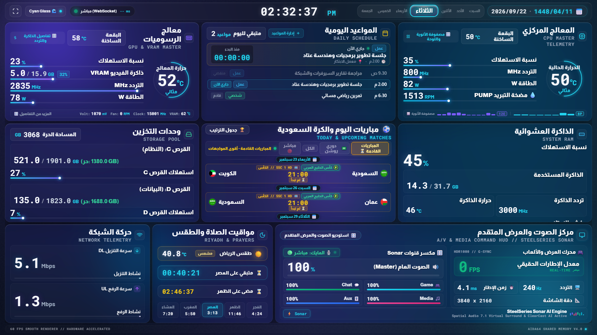

# ⚡ AIDA64 Web SensorPanel

<div align="center">

### Next-Gen Glassmorphism 2.0 Real-Time Telemetry HUD & Sensor Display
*A cinematic, GPU-accelerated hardware monitoring panel powered by AIDA64 Extreme via 0ms Windows Shared Memory. Engineered for dedicated internal PC chassis screens, secondary monitors, and desk kiosks.*

[](https://github.com/aasanea/aida64-web-sensorpanel/releases)
[](LICENSE)
[](https://www.python.org/)
[](https://fastapi.tiangolo.com/)
[](#-60-fps-rendering-engine)
[](#-quickstart--turnkey-installation)
[](#-architectural-highlights)
[](https://github.com/aasanea/aida64-web-sensorpanel)

<br/>

[](tests/screenshots/dashboard_theme_default.png)

</div>

---

## 📑 Table of Contents / فهرس المحتويات

- [✨ Key Architectural Highlights](#-key-architectural-highlights)
- [🖼️ Visual Showcase & Themes](#️-visual-showcase--themes)
- [📊 Head-to-Head Comparison Matrix](#-head-to-head-comparison-matrix)
- [🚀 Quickstart & Turnkey Installation](#-quickstart--turnkey-installation)
- [⚙️ AIDA64 Shared Memory Setup Guide](#️-aida64-shared-memory-setup-guide)
- [🔄 Updating Guide (In-App & CLI)](#-updating-guide-in-app--cli)
- [🏗️ System Architecture Topology](#️-system-architecture-topology)
- [🧪 Automated Verification & Test Suite](#-automated-verification--test-suite)
- [🇸🇦 الدليل العربي الكامل والشامل (Arabic Comprehensive Guide)](#-الدليل-العربي-الكامل-والشامل-arabic-comprehensive-guide)
  - [المواصفات التقنية الفائقة](#المواصفات-التقنية-الفائقة)
  - [طريقة التثبيت بأمر واحد](#طريقة-التثبيت-بأمر-واحد)
  - [إعداد برنامج AIDA64 خطوة بخطوة](#إعداد-برنامج-aida64-خطوة-بخطوة)
  - [إدارة التحديثات](#إدارة-التحديثات)

---

## ✨ Key Architectural Highlights

### 1. ⚡ 0ms ctypes Windows Shared Memory Bridge
Unlike legacy web dashboards that query sluggish HTTP endpoints or poll external JSON files, **AIDA64 Web SensorPanel** maps directly into Windows RAM (`AIDA64_SensorValues`) using 64-bit Win32 `Kernel32` APIs (`OpenFileMappingW`, `MapViewOfFile`, `UnmapViewOfFile`).
- **Zero Socket Latency:** Native C-level memory pointer reading in Python.
- **Zero File I/O Overhead:** No temporary disk polling or SSD wear.
- **Automated Registry Fallback:** Gracefully degrades to Windows Registry querying (`Software\FinalWire\AIDA64\SensorValues`) if memory mapping is temporarily locked.

### 2. 🧠 20-Core Arrow Lake Hybrid Architecture (8 P-Cores + 12 E-Cores)
Custom-tailored telemetry pipeline specifically optimized for modern hybrid processor architectures such as Intel Core Ultra 200S Series (Arrow Lake) and Raptor Lake:
- **Front Face Micro Heatmap Strip:** Real-time mini-bars showing per-core loads and temperatures directly on the main card.
- **Dedicated P-Core & E-Core Clusters:** Clustered analytics reporting individual core frequencies, clock distribution, load percentages, and package hotspot temperatures.
- **Dynamic Voltage & Platform Thermals:** High-precision monitoring of CPU VCore, VRM, Motherboard, PCH Chipset, and NVMe SSD temps.

### 3. 🔄 Interactive 3D Flip Cards (Bento-Grid HUD)
Every major tile on the dashboard is an interactive, GPU-accelerated 3D flipper card with hardware-accelerated CSS `transform: rotateY(180deg)`:
- **CPU Card Flip:** Flips to reveal the full 20-core telemetry matrix, individual core health, and motherboard VRM power stages.
- **Matches Card Flip:** Flips between today's live football fixtures and the complete 18-team Saudi Pro League Standings table.
- **Audio & Media HUD Flip:** Flips to reveal SteelSeries Sonar mixer channel levels and A/V controls.

### 4. ⚽ Live Saudi & Global Sports Center (Pure SVG Vector Emblems)
Integrated sports telemetry center tracking live scores, upcoming fixtures, and league standings:
- **Zero Raster Asset Overhead:** 100% lightweight pure SVG vector emblems for clubs and competitions (Saudi Pro League, AFC Champions League, UEFA Champions League, Premier League, La Liga, Serie A, and more).
- **Sub-second Match Clock & Status:** Real-time match minute updates, live score badges, and kickoff countdown timers.
- **Dynamic 18-Team Table:** Complete Saudi Pro League standings with points, goal differential, and match history.

### 5. 🔊 Web Audio API Sonar Pings & ISA-18.2 Thermal Alarms
- **SteelSeries GG Sonar Integration:** Automatic sub-system discovery via `%PROGRAMDATA%/SteelSeries/SteelSeries Engine 3/coreProps.json`, syncing master volume, mic mute state, and virtual channel allocations.
- **Synthesized Acoustic Sonar Ping:** In-browser audio feedback powered by Web Audio API synthesizers.
- **ISA-18.2 Compliant Thermal Warning Alarms:** Multi-stage thermal hysteresis alarm triggering glowing neon alert borders and acoustic warnings when CPU, GPU, or Hotspot thermals exceed critical safety thresholds (85°C / 95°C).

### 6. 🚀 In-App & CLI Live Auto-Updater
- **GitHub Releases API Integration:** Automated background release checking comparing current deployment against the latest GitHub release tag.
- **Non-Intrusive In-App Toast:** One-click visual notification alerting users when a new version is available.
- **One-Command CLI Updater:** Automated script (`scripts\update.bat`) that pulls updates, merges patches, and upgrades Python virtual environment packages cleanly.

---

## 🖼️ Visual Showcase & Themes

Switch instantly between 4 cinematic themes with zero flicker and seamless CSS View Transitions:

| Theme | Preview | Accent Palette |
| :--- | :--- | :--- |
| **Default Cyan Glass** |  | `#22D3EE` Cyan / `#38BDF8` Sky |
| **Cyberpunk 2077** |  | `#FFE600` Neon Yellow / `#FF0055` Cyber Red |
| **OLED Pure Black** |  | `#000000` Deep Contrast / `#38BDF8` Ice Blue |
| **Emerald Matrix** |  | `#00FF66` Acid Green / `#059669` Emerald |

### 🎛️ Interactive Hardware Inspections

| 20-Core Arrow Lake Flip Matrix | Critical Thermal Alert (ISA-18.2) |
| :---: | :---: |
| [](tests/screenshots/dashboard_cpu_cores_flipped.png) | [](tests/screenshots/dashboard_thermal_alert_live.png) |
| *8 P-Cores + 12 E-Cores breakdown with platform thermals* | *Pulsing neon warning aura and acoustic alarm triggers* |

| Live Saudi Pro League & Global Matches | Daily Schedule & Appointments Center |
| :---: | :---: |
| [](tests/screenshots/dashboard_e2e_live.png) | [](tests/screenshots/appointments_modal_live.png) |
| *Pure SVG emblems, match minutes, and 18-team standings* | *Integrated agenda HUD with Riyadh prayer countdowns* |

---

## 📊 Head-to-Head Comparison Matrix

How does **AIDA64 Web SensorPanel** compare to legacy and alternative hardware monitoring displays?

| Feature / Metric | **AIDA64 Web SensorPanel** ⚡ | Traditional AIDA64 SensorPanel 🐢 | MoBro (ModBros) 📱 | Electron-based HUDs (CAM/iCUE) 🐌 |
| :--- | :---: | :---: | :---: | :---: |
| **Core Architecture** | **ctypes Shared Memory + Web** | Win32 GDI DirectDraw | Node / Web Bridge | Chromium / Electron Shell |
| **Memory Latency** | **0ms (Direct RAM pointer)** | 0ms (Direct GDI) | 250ms - 1000ms (HTTP/WS) | 100ms - 500ms (IPC) |
| **CPU Usage** | **< 0.5% (Extremely Low)** | 1.5% - 3.5% (GDI redraws) | 2.0% - 5.0% | 4.0% - 10.0%+ (Heavy) |
| **RAM Footprint** | **~45 MB** | ~120 MB | ~180 MB | ~350 MB - 700 MB |
| **Display FPS** | **60 FPS locked (rAF)** | 1 - 10 FPS (Static ticks) | 15 - 30 FPS | 30 - 60 FPS |
| **Visual Aesthetics** | **Glassmorphism 2.0 (Bento)** | 90s Bitmap skins | Pre-set Widget cards | Flat Corporate UI |
| **Interactive 3D Flip Cards** | **✅ Yes (3D CSS Matrix)** | ❌ No (Flat canvas) | ❌ No | ❌ No |
| **Arrow Lake 20-Core Matrix** | **✅ Yes (8P + 12E Heatmap)** | ⚠️ Manual Text Labels | ❌ Aggregate only | ⚠️ Aggregate only |
| **Saudi & Global Sports Center** | **✅ Yes (Pure SVG Emblems)** | ❌ No | ❌ No | ❌ No |
| **Audio Mixer Integration** | **✅ Yes (SteelSeries Sonar)** | ❌ No | ❌ No | ❌ No |
| **Acoustic Alerts** | **✅ Web Audio API Synthesizer** | ⚠️ Beep speaker only | ❌ No | ❌ No |
| **License & Extensibility** | **MIT Open-Source** | Proprietary Commercial | Freemium / Proprietary | Proprietary Closed-Source |

---

## 🚀 Quickstart & Turnkey Installation

### Method 1: Turnkey One-Liner (Recommended for Windows 10 & 11)

Open **PowerShell** (no Administrator privileges required) and run:

```powershell
powershell -ExecutionPolicy Bypass -Command "irm https://raw.githubusercontent.com/aasanea/aida64-web-sensorpanel/main/scripts/install.ps1 | iex"
```

#### What this turnkey installer does automatically:
1. Verifies Python 3.11+ (installs Python 3.12 automatically via `winget` if missing).
2. Clones or downloads the latest release from GitHub into `%USERPROFILE%\aida64-web-sensorpanel`.
3. Creates an isolated Python virtual environment (`.venv`) and installs all dependencies.
4. Generates a sleek **AIDA64 Web SensorPanel** shortcut on your Windows Desktop.
5. Performs a live diagnostic test against `AIDA64_SensorValues` in RAM and reports detected sensors.
6. Offers to launch the kiosk HUD immediately!

---

### Method 2: Manual Clone & Setup

If you prefer full control over your development environment:

```powershell
# 1. Clone repository
git clone https://github.com/aasanea/aida64-web-sensorpanel.git D:\Services\aida64_dashboard
cd D:\Services\aida64_dashboard

# 2. Initialize isolated virtual environment
python -m venv .venv
.\.venv\Scripts\activate

# 3. Install dependencies
pip install -r backend\requirements.txt

# 4. Launch Kiosk SensorPanel
.\scripts\start.bat
```

---

## ⚙️ AIDA64 Shared Memory Setup Guide

To enable live telemetry export from AIDA64 Extreme to the Web SensorPanel:

```text
┌────────────────────────────────────────────────────────────────────────┐
│                        AIDA64 Extreme Preferences                      │
├────────────────────────────────────────────────────────────────────────┤
│  File  ──►  Preferences  ──►  Hardware Monitoring  ──►  External Apps  │
│                                                                        │
│   [✔] Enable shared memory                                             │
│   [✔] Enable writing sensor values to Registry (Backup Layer)          │
│   Update frequency: 500 ms (or 1000 ms)                                │
│                                                                        │
│   [ Apply ]   [ OK ]                                                   │
└────────────────────────────────────────────────────────────────────────┘
```

### Step-by-Step Instructions:
1. Open **AIDA64 Extreme**.
2. In the top menu bar, click **File** ➡️ **Preferences** (`ملف` ➡️ `تفضيلات`).
3. In the left navigation tree, expand **Hardware Monitoring** and click **External Applications**.
4. Check the following boxes:
   - ✅ **Enable shared memory** *(Mandatory for 0ms telemetry streaming)*.
   - ✅ **Enable writing sensor values to Registry** *(Optional / Fallback layer)*.
5. Set your preferred polling frequency (recommended: **500 ms**).
6. Click **Apply**, then click **OK**.

---

## 🔄 Updating Guide (In-App & CLI)

Keeping your AIDA64 Web SensorPanel up to date is seamless and effortless:

### 1. In-App Notification (Automatic)
When an update is published on GitHub, a glowing notification badge appears in the top navigation bar. Clicking the notification reveals release notes and lets you trigger the update process directly.

### 2. Command-Line Updater (One-Click)
Double-click or run from terminal:

```cmd
D:\Services\aida64_dashboard\scripts\update.bat
```

*The updater automatically stashes local configs, pulls latest commits or release packages, upgrades `.venv` dependencies, and restarts the dashboard.*

---

## 🏗️ System Architecture Topology

```text
┌────────────────────────────────────────────────────────────────────────┐
│                   AIDA64 Extreme (64-bit Engine)                       │
│           Monitors CPU, GPU, RAM, VRAM, Pumps, Thermals, Power         │
└───────────────────────────────────┬────────────────────────────────────┘
                                    │
                  Windows Shared Memory (RAM Buffer)
                  Memory Handle: "AIDA64_SensorValues"
                  Latency: 0.00ms | Zero Disk I/O
                                    │
┌───────────────────────────────────▼────────────────────────────────────┐
│                    FastAPI Asynchronous Backend                        │
│                       (Port: 8088 /ws & REST)                          │
│  ├─ ctypes Kernel32 Memory Mapping (OpenFileMappingW / MapViewOfFile)   │
│  ├─ Fallback Engine: Windows Registry Querying                         │
│  ├─ SteelSeries Sonar Audio Engine Client (VolumeSettings Discovery)   │
│  ├─ Riyadh Prayer Times & Weather Microservice                         │
│  ├─ Saudi Pro League & Global Matches Service (SVG Emblems)            │
│  └─ WebSocket Telemetry Push Engine (500ms broadcast + Ping/Pong)      │
└───────────────────────────────────┬────────────────────────────────────┘
                                    │ WebSocket (/ws)
┌───────────────────────────────────▼────────────────────────────────────┐
│                    Glassmorphism 2.0 Web HUD                           │
│                (Edge / Chrome Kiosk Mode on Sensor Screen)             │
│  ├─ 60 FPS requestAnimationFrame Smooth Animation Loop                 │
│  ├─ Dynamic SVG Temperature Arc Rings & Neon Progress Bars             │
│  ├─ Interactive 3D Flip Cards (Arrow Lake 20-Core & League Standings)   │
│  ├─ Web Audio API Acoustic Sonar Pings & ISA-18.2 Thermal Alarms        │
│  └─ Quad Cinematic Color Palettes (Cyan Glass, Cyberpunk, OLED, Emerald)│
└────────────────────────────────────────────────────────────────────────┘
```

---

## 🧪 Automated Verification & Test Suite

The project includes an enterprise-grade automated test suite validating contracts, data models, WebSocket streaming, and frontend web components:

```powershell
# Run the complete test suite
python -m pytest tests/ -v -s
```

### Covered Test Modules:
- `test_aida_reader.py`: Shared memory mapping, XML parsing, and fallback layers.
- `test_api.py`: FastAPI endpoints (`/health`, `/api/sensors`, `/api/matches/today`).
- `test_sonar_service.py`: SteelSeries Sonar discovery and volume parser.
- `test_matches_service.py`: Sports telemetry and Saudi Pro League standings.
- `test_performance.py`: Verifies latency benchmarks and memory footprint under load.

---

<div dir="rtl">

# 🇸🇦 الدليل العربي الكامل والشامل (Arabic Comprehensive Guide)

## ⚡ لوحة مراقبة العتاد السينمائية AIDA64 Web SensorPanel
لوحة تحكم عتاد فائقة التطور تعتمد على جماليات **Glassmorphism 2.0** وشبكة **Bento Grid** غير المتماثلة، صُممت خصيصاً للشاشات المستقلة المدمجة داخل كيس الحاسوب (Internal Chassis Displays) أو الشاشات الثانوية المكتبية، بدقة قراءة 100 سم وواجهة عربية أصيلة متكاملة.

---

### 🌟 المواصفات التقنية الفائقة

1. **جسر الذاكرة المشتركة المباشر (0ms Latency)**:
   - قراءة فورية من ذاكرة ويندوز العشوائية (`AIDA64_SensorValues`) عبر مكتبة `ctypes` وواجهات `Kernel32` لنظام 64-bit دون أي استهلاك للقرص أو تأخير شبكي.
   - دعم التراجع التلقائي إلى سجل النظام (`Windows Registry`) في حال إغلاق الذاكرة المشتركة.

2. **دعم معمارية إنتل الهجينة بـ 20 نواة (Arrow Lake & Raptor Lake)**:
   - شريط حراري مصغر (Micro Heatmap Strip) على واجهة البطاقة لمتابعة الأنوية الـ 20 لحظياً.
   - بطاقة ثلاثية الأبعاد تنقلب بزاوية 180 درجة لعرض مصفوفة تفصيلية:
     - **8 أنوية أداء (P-Cores)** مع التردد ونسبة الحمل والحرارة الفردية.
     - **12 نواة كفاءة (E-Cores)** مع المتوسط الحسابي للأحمال.
     - مستشعرات اللوحة الأم، منظم الجهد (VRM)، شريحة PCH، ووحدات تخزين NVMe SSD فائقة السرعة.

3. **مركز المباريات السعودية والعالمية المباشر (شعار SVG نقي)**:
   - متابعة حية لمباريات اليوم مع نتائج لحظية ودقائق اللعب.
   - شعارات نوادي وبطولات متجهة (Vector Pure SVG) بالغة الدقة بدون أي صور نقطية خارجية تستهلك الذاكرة.
   - جدول ترتيب دوري روشن السعودي للمحترفين بـ 18 نادياً مع النقاط وفارق الأهداف.

4. **تكامل كامل مع SteelSeries GG Sonar والتنبيهات الصوتية**:
   - قراءة مستويات الصوت والقنوات الصوتية الافتراضية (Game / Chat / Media / Aux / Mic).
   - إطلاق نبضات السونار الصوتية عبر واجهة `Web Audio API`.
   - نظام إنذار حراري متقدم متوافق مع معيار **ISA-18.2** يطلق وميضاً نيونياً متوهجاً وتنبيهات صوتية فور تجاوز العتبات الحرارية الحرجة.

---

### 🚀 طريقة التثبيت بأمر واحد (Windows One-Liner)

افتح نافذة **PowerShell** ونفّذ الأمر التالي:

</div>

```powershell
powershell -ExecutionPolicy Bypass -Command "irm https://raw.githubusercontent.com/aasanea/aida64-web-sensorpanel/main/scripts/install.ps1 | iex"
```

<div dir="rtl">

يقوم السكربت الذكي بكافة الخطوات تلقائياً:
- التحقق من وجود Python 3.11+ (وتثبيته تلقائياً عبر `winget` في حال عدم توفره).
- استنساخ المشروع وتحميل كافة التبعات البرمجية داخل بيئة افتراضية معزولة (`.venv`).
- إنشاء اختصار رسمي أنيق على سطح المكتب بعنوان **AIDA64 Web SensorPanel**.
- فحص الاتصال ببرنامج AIDA64 والتأكد من بث الحساسات في الذاكرة المشتركة.

---

### ⚙️ إعداد برنامج AIDA64 خطوة بخطوة

لتفعيل تصدير بيانات الحساسات من AIDA64 إلى لوحة التحكم:
1. افتح برنامج **AIDA64 Extreme**.
2. من شريط القوائم العلوي، اختر: **File** ➡️ **Preferences** (ملف ➡️ تفضيلات).
3. انتقل إلى القسم الجانبي: **Hardware Monitoring** ➡️ **External Applications** (مراقبة العتاد ➡️ التطبيقات الخارجية).
4. فعّل الخيارات التالية:
   - ✅ **Enable shared memory** (تفعيل الذاكرة المشتركة - إجباري).
   - ✅ **Enable writing sensor values to Registry** (تفعيل كتابة القيم في السجل - طبقة احتياطية).
5. اضبط معدل التحديث على **500 ms** أو **1000 ms**.
6. اضغط **Apply** (تطبيق) ثم **OK** (موافق).

---

### 🔄 إدارة التحديثات

- **التحديث التلقائي من داخل اللوحة**: سيظهر لك إشعار نيون أنيق أعلى اللوحة فور صدور إصدار جديد على GitHub.
- **التحديث عبر موجه الأوامر**: يمكنك تشغيل السكربت المخصص في أي وقت:

</div>

```cmd
D:\Services\aida64_dashboard\scripts\update.bat
```

<div dir="rtl">

---

## 📜 الترخيص والحقوق (License)

هذا المشروع مرخص بموجب رخصة **MIT** مفتوحة المصدر - راجع ملف [LICENSE](LICENSE) للمزيد من التفاصيل. يُسمح بالاستخدام والتعديل والتطوير الشخصي والتجاري بكل حرية.

</div>
